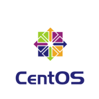

# ocaws-design


Infrastructure as code for AWS, Openshift, CI, CD and devops methodology.


Deployment solution for OpenShift Origin on Amazon Web Services.

## Overview

The repository contains bash scripts to clone git repositories , AWS cloudformation stackset(via Ansible), Openshift command line instructions to create apps and a complete CI/CD environment.


## Architecture

This solution follows reference architecture from https://github.com/openshift/openshift-ansible-contrib/blob/master/reference-architecture/aws-ansible/README.md

It has 3 masters in different availability zones, 3 infrastructure and 2 application nodes. The infrastructure and application nodes are split between availability zones. End-user projects are deployed between application nodes and CI/CD environment on infrastructure nodes both following a full autoscale(Kubernetes) autodiscovery and autohealing setting (NetflixOSS).


## Prerequisites

An **AWS IAM active user** with a role and it's set of permission/policies for VPC, EC2, Cloudformation, ELB, Route53, S3, EBS or a full administration role(our case).


**A keypair from IAM user.**


**A registered domain** configured in Route53 as a Hosted Zone before installation.


**Linux environment** (baremetal or virtualized) for scripts execution.

eg. https://app.vagrantup.com/centos/boxes/7



**Linux AWS EC2 AMI**

We use AMI ami-6d1c2007, a Centos 7 Based AMI. You can use Red hat 7 or Fedora Atomic AMI

**Note**
```
Please subscribe to AMI's marketplace page before using it. eg. for Centos 7 https://aws.amazon.com/marketplace/pp/B00O7WM7QW?qid=1504669674902&sr=0-1&ref_=srh_res_product_title.
  ```


### Configure key and proxy for ssh:

```Shell
$ ssh-keygen -t rsa -b 4096 -C user@somemail.com -f OSE-key
```

Copy SSH config for bastion host

```Shell
$ cat >/home/vagrant/.ssh/config <<EOF
Host *.#{PUBLIC_HOSTED_ZONE}
ProxyCommand               ssh ec2-user@bastion -W %h:%p
IdentityFile               /home/vagrant/.ssh/OSE-key.pem

Host bastion
Hostname                   bastion.#{PUBLIC_HOSTED_ZONE}
user                       ec2-user
StrictHostKeyChecking      no
ProxyCommand               none
CheckHostIP                no
ForwardAgent               yes
IdentityFile               /home/vagrant/.ssh/OSE-key.pem
EOF
```

Set permissions

```Shell
$ chmod 400 OSE-key.*
```

## Infrastructure creation

Execute following steps to begin installation:

Copy keypair to home user's ssh folder, eg. OSE-key.pub & OSE-key.pem to /home/vagrant/.ssh/

```Shell
$ cp ocaws-design/OSE-key.* /home/vagrant/.ssh/
```

Export env variables

```Shell
$ export AWS_ACCESS_KEY_ID=XXXX
export AWS_SECRET_ACCESS_KEY=XXXX
export GITHUB_CLIENT_ID=XXXX
export GITHUB_CLIENT_SECRET=XXXX
export GITHUB_ORGANIZATION=sctechnology
export PUBLIC_HOSTED_ZONE=aws.sc.technology
export REGION=us-east-1
```

Run infrabuild.sh shell script

```Shell
$ sh ocaws-design/infrabuild.sh
```

In the background, an AWS Cloudformation StackSet is defined by Ansible and created on different Amazon Web Services.


We can monitor if services are completely deployed in our AWS console.


When script finished, now we have a full functional Openshift Environment on top of Amazon's AWS.


## Deploying CI/CD

Run cicd.sh shell script
```Shell
$ sh ocaws-design/cicd.sh deploy msa-cicd-eap --project-suffix santiagoangel-conekta --ephemeral 
```

The script creates a set of services(jenkins, sonarqube, nexus).

Applications make use of this set from Openshift pipeline feature. https://blog.openshift.com/openshift-3-3-pipelines-deep-dive/


## Applications

Run apps.sh shell script
```Shell
$ sh ocaws-design/apps.sh
```

The script creates a set of microservices in different languages (Java, JavaScript, HTML) and frameworks (JBoss Swarm, Spring Boot, Vert.x, NodeJS, Angularjs) with NetflixOSS.


